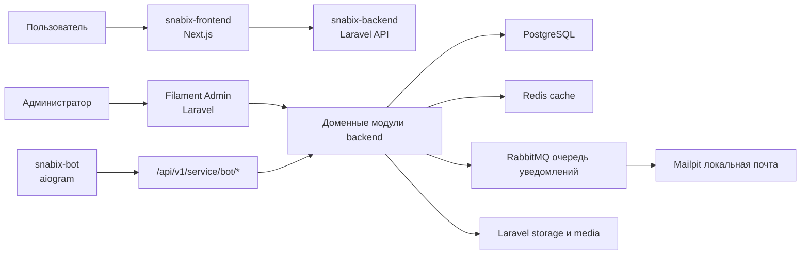

# Архитектура Snabix

Документ описывает общую архитектуру Snabix и роль backend-сервиса.

## Общая схема



Backend является источником истины для пользователей, ролей, объявлений, категорий, уведомлений, медиа и прав доступа. Frontend отвечает за интерфейс и UX-состояния. Telegram-бот не обращается к базе напрямую и работает только через service API backend.

## Репозитории

### `snabix-backend`

Путь:

```text
$PROJECT_ROOT/snabix-backend
```

Назначение:

- Laravel API;
- Filament admin panel;
- доменная логика;
- PostgreSQL persistence;
- очереди RabbitMQ;
- Redis cache;
- Mailpit в локальной разработке;
- storage и media lifecycle;
- service API для Telegram-бота.

### `snabix-frontend`

Путь:

```text
$PROJECT_ROOT/snabix-frontend
```

Назначение:

- публичная витрина;
- личный кабинет;
- формы объявлений;
- настройки профиля;
- работа с сессией;
- отображение уведомлений;
- адаптивный интерфейс.

### `snabix-telegram-bot`

Путь:

```text
$PROJECT_ROOT/snabix-telegram-bot
```

Назначение:

- сервисный Telegram-бот;
- admin health commands;
- статистика backend;
- будущие moderation shortcuts;
- будущий Telegram-канал уведомлений.

## Слои backend

Backend разделен по доменным модулям:

- `Auth`: пользователи, профиль, адреса, сессии, email verification.
- `Catalog`: категории, дерево каталога, характеристики.
- `Listing`: объявления, статусы, избранное, атрибуты.
- `Media`: медиафайлы, storage, path generator, cleanup.
- `Notification`: in-app и email уведомления.
- `Bot`: service API для Telegram-бота.
- `Shared`: общая инфраструктура, логи, health checks.

Внутри доменов используется структура:

- `Domain`: enum, события, contracts, value objects, policies.
- `Application`: use cases, services, normalizers, mappers.
- `Infrastructure`: Eloquent models, repositories, queries, providers.
- `Http`: controllers, requests, responses.
- `Filament`: admin resources, pages, widgets.

Правило: HTTP и Filament не должны содержать бизнес-логику. Они собирают input, вызывают application/domain слой и возвращают результат.

## Основные API-группы

- `POST /api/v1/auth/sign-up`
- `POST /api/v1/auth/sign-in`
- `GET /api/v1/auth/me`
- `GET /api/v1/categories/list`
- `GET /api/v1/categories/{categoryId}/branch`
- `GET /api/v1/categories/{categoryId}/attributes`
- `GET /api/v1/public/listings`
- `GET /api/v1/public/listings/{listingId}`
- `GET /api/v1/listings`
- `POST /api/v1/listings`
- `PATCH /api/v1/listings/{listingId}`
- `POST /api/v1/listings/{listingId}/media`
- `POST /api/v1/listings/{listingId}/favorite`
- `DELETE /api/v1/listings/{listingId}/favorite`
- `GET /api/v1/notifications`
- `GET /api/v1/notifications/preferences`
- `GET /api/v1/service/bot/health`
- `GET /api/v1/service/bot/me`
- `GET /api/v1/service/bot/stats`

Приватные пользовательские маршруты защищены `auth:sanctum`. Service API для Telegram-бота защищен middleware `bot.service`.

## Владение данными

- Профиль и адреса пользователя принадлежат backend `Auth`.
- Категории и характеристики принадлежат backend `Catalog`.
- Жизненный цикл объявлений принадлежит backend `Listing`.
- Постоянные медиа и записи таблицы `media` принадлежат backend `Media`.
- Настройки и доставка уведомлений принадлежат backend `Notification`.
- Состояние формы на frontend является UX-состоянием, а не источником истины.
- Telegram admin ids хранятся в bot env, но бизнес-данные остаются на backend.

## Целостность конкурентных записей

PostgreSQL является последней границей целостности для marketplace write-моделей:

- listing type/status/condition, price, currency и views закреплены именованными `CHECK`;
- review rating/status и разные reviewer/reviewee закреплены именованными `CHECK`;
- seller rating aggregate ограничен диапазоном `1..5` и согласован с reviews count;
- уникальные email и review обрабатываются по конкретному имени constraint после rollback транзакции и возвращают `422`, а не `500`;
- sign-up и create review поддерживают `Idempotency-Key`, request fingerprint и replay ранее созданного ресурса;
- пересчет seller rating выполняется под row lock пользователя, чтобы параллельные отзывы не перезаписывали aggregate устаревшим значением.

Idempotency records имеют ограниченный срок хранения и удаляются scheduler-задачей. Исходные ключи и payload в таблице не сохраняются.

## Очереди и асинхронная работа

RabbitMQ используется для очередей `notifications` и `media-maintenance`.

Локальный запуск:

```bash
docker compose up -d rabbitmq queue-worker
```

Почта в локальной среде перехватывается Mailpit:

```bash
docker compose up -d mailpit
```

Интерфейс:

```text
http://127.0.0.1:8025
```

## Storage и обслуживание

Техническая очистка:

```bash
php artisan shared:cleanup-storage --dry-run
```

Поиск постоянных медиа без записи в БД:

```bash
php artisan media:cleanup-orphans
```

Постоянные пользовательские медиа нельзя удалять по возрасту. Удаление допустимо только через доменную логику или после orphan-проверки с БД.

## Архитектурные правила

- Frontend и bot не обращаются к БД напрямую.
- Backend DTO changes должны синхронизироваться с frontend Zod schemas.
- Backend changes должны отражаться в `CHANGELOG.md`.
- Тесты должны использовать `db-test/snabix_test`.
- Нельзя запускать destructive-команды против основной базы `snabix`.
- Permanent media cleanup всегда начинается с dry-run.
- Service tokens и bot tokens нельзя коммитить.
