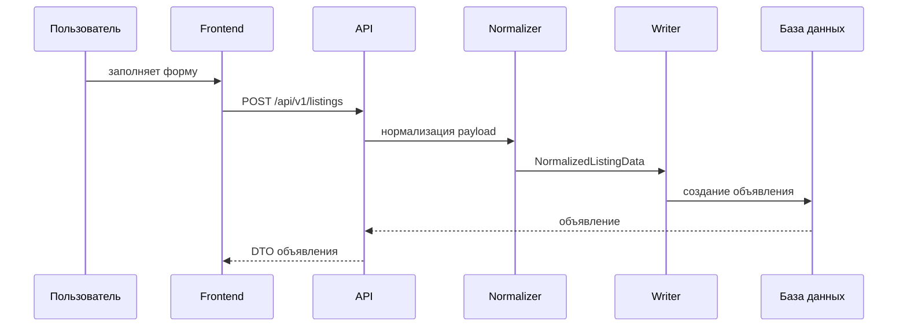

# Жизненный цикл объявления

Документ описывает путь объявления от создания до удаления.

## Файлы backend-сервиса

- `app/Listing/Domain/Enums/ListingStatus.php`
- `app/Listing/Domain/Services/ListingPublicationPolicy.php`
- `app/Listing/Domain/Services/ListingStatusTransitionPolicy.php`
- `app/Listing/Application/UseCases/CreateListing`
- `app/Listing/Application/UseCases/UpdateListing`
- `app/Listing/Application/UseCases/SubmitListingForReview`
- `app/Listing/Application/UseCases/ArchiveListing`
- `app/Listing/Application/UseCases/DeleteListing`
- `app/Listing/Application/Normalizers`
- `app/Listing/Application/Services/ListingAddressSnapshotService.php`
- `app/Listing/Application/Services/ListingRequiredAttributeValidator.php`
- `app/Listing/Infrastructure/Queries/PublicListingQuery.php`
- `app/Listing/Infrastructure/Queries/OwnedListingQuery.php`
- `app/Listing/Infrastructure/Repositories/EloquentListingWriter.php`

## Файлы клиентского приложения

- `src/features/listing/ui/listing-form.tsx`
- `src/features/listing/ui/listing-editor-form.tsx`
- `src/features/listing/model/use-listing-form-state.ts`
- `src/features/listing/model/use-listing-form-coordinator.ts`
- `src/features/listing/model/use-listing-category-state.ts`
- `src/features/listing/model/use-listing-attribute-state.ts`
- `src/features/listing/model/use-listing-address-state.ts`
- `src/features/listing/model/use-listing-media-state.ts`
- `src/features/listing/model/use-listing-submit.ts`
- `src/features/listing/ui/listing-management-menu.tsx`

## Статусы

- `DRAFT`: черновик.
- `PENDING_REVIEW`: на проверке.
- `PUBLISHED`: опубликовано.
- `REJECTED`: отклонено.
- `ARCHIVED`: в архиве.

Разрешенные переходы:

```text
DRAFT          -> PENDING_REVIEW, ARCHIVED
PENDING_REVIEW -> PUBLISHED, REJECTED, ARCHIVED
PUBLISHED      -> ARCHIVED
REJECTED       -> DRAFT, PENDING_REVIEW, ARCHIVED
ARCHIVED       -> DRAFT
```

Источник истины: `ListingStatusTransitionPolicy`.

## Создание



Если пользователь сохраняет черновик, статус `DRAFT`. Если отправляет объявление, статус `PENDING_REVIEW`.

Обязательные характеристики проверяются для всех статусов, кроме черновика.

## Адресный snapshot

Объявление хранит snapshot адреса, чтобы отображение объявления не менялось неожиданно после редактирования адресов в профиле.

Единый формат отображения:

```text
Регион, город, улица и номер дома
```

Будущая интеграция карт должна расширять snapshot, а не ломать текущие поля. Возможные будущие поля:

- `latitude`
- `longitude`
- `geo_provider`
- `geo_place_id`
- `formatted_address`

## Категории и характеристики

Frontend получает:

- корневые категории из `/api/v1/categories/list`;
- ветку из `/api/v1/categories/{categoryId}/branch`;
- характеристики из `/api/v1/categories/{categoryId}/attributes`.

Frontend показывает поля для удобства пользователя. Backend остается главным валидатором обязательности, типов и dependency rules.

## Действия владельца

Frontend:

- `listing-owner-actions-policy.ts`
- `listing-management-menu.tsx`

Backend все равно обязан проверять права через policies/use cases.

Типовые действия:

- редактировать;
- отправить на проверку;
- архивировать;
- удалить;
- управлять изображениями.

## Публичная выдача

Маршруты:

- `GET /api/v1/public/listings`
- `GET /api/v1/public/listings/{listingId}`

Публичный DTO не должен отдавать приватные поля владельца.

## Личный кабинет

Маршруты:

- `GET /api/v1/listings`
- `GET /api/v1/listings/{listingId}`
- `PATCH /api/v1/listings/{listingId}`
- `DELETE /api/v1/listings/{listingId}`

Private DTO может отдавать management-поля, нужные владельцу.

## Избранное

Маршруты:

- `POST /api/v1/listings/{listingId}/favorite`
- `DELETE /api/v1/listings/{listingId}/favorite`
- `GET /api/v1/listings/favorites`

Все три маршрута возвращают public card DTO без `userId`, контактов,
`rejectionReason` и полного `media` payload. Аутентификация нужна для управления
избранным, но не дает доступ к owner projection чужого объявления. Для
собственного объявления management DTO доступен через личный список/просмотр.

Если чужое объявление добавили в избранное, backend создает уведомление владельцу.

## Удаление

Удаление объявления должно:

- проверить права;
- удалить запись объявления;
- очистить коллекцию media объявления;
- сохранить системные логи, где это нужно;
- не падать из-за побочных notification-ошибок.

Подробности по файлам описаны в `MEDIA_LIFECYCLE.md`.

## Тесты

- `tests/Feature/Listing/CreateListingTest.php`
- `tests/Feature/Listing/ShowAndUpdateListingTest.php`
- `tests/Feature/Listing/ListAndDeleteListingTest.php`
- `tests/Feature/Listing/ListingMediaUploadTest.php`
- `tests/Feature/Listing/ListingFavoriteTest.php`
- frontend `tests/e2e/listing-management.spec.ts`

## Правила изменений

- Новые статусы должны обновлять policy, tests и этот документ.
- Новое поле объявления должно обновлять backend DTO, frontend schema и form defaults.
- Новое обязательное поле должно учитывать режим черновика.
- Новое публичное поле нужно проверить на privacy leak.
- Медиа нельзя удалять без проверки владения и записи в БД.
