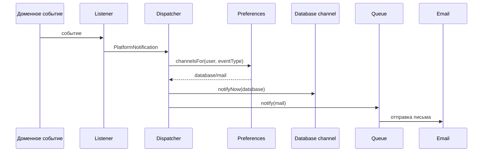

# Архитектура уведомлений

Snabix поддерживает два канала уведомлений:

- уведомления внутри сайта через database notifications;
- email-уведомления через очередь.

В локальной разработке email перехватывается Mailpit.

## Компоненты backend-сервиса

- `app/Notification/Domain/Enums/NotificationEventType.php`
- `app/Notification/Application/Notifications/PlatformNotification.php`
- `app/Notification/Application/Services/NotificationPreferenceService.php`
- `app/Notification/Application/Services/PlatformNotificationDispatcher.php`
- `app/Notification/Application/Listeners/SendSecurityLoginNotification.php`
- `app/Notification/Application/Listeners/SendListingFavoritedNotification.php`
- `app/Notification/Http/UserNotificationsController.php`
- `app/Notification/Http/NotificationPreferencesController.php`
- `app/Notification/Infrastructure/Models/EloquentNotificationPreference.php`

## Компоненты клиентского приложения

- `src/screens/account/settings/ui/settings-notifications-page.tsx`
- header notification UI в `src/shared/ui/header`
- API adapters для уведомлений

## Типы событий

Текущие ключи:

- `new_messages`
- `listing_replies`
- `favorite_listings`
- `listing_views`
- `recommendations`
- `price_changes`
- `listing_expiration`
- `security_login`
- `promotions_news`
- `email_digest`

Категории:

- `messages`
- `listings`
- `activity`
- `system`

`security_login` является обязательным для site-канала.

## Поток доставки



Важное поведение:

- database channel отправляется сразу через `notifyNow`;
- mail channel отправляется через очередь `notifications`;
- email не придет, если `queue-worker` не запущен;
- побочная ошибка уведомления не должна ломать основное действие, если само уведомление не является действием.

## API

Все маршруты требуют `auth:sanctum`:

- `GET /api/v1/notifications`
- `PATCH /api/v1/notifications/read-all`
- `DELETE /api/v1/notifications`
- `PATCH /api/v1/notifications/{notificationId}/read`
- `DELETE /api/v1/notifications/{notificationId}`
- `GET /api/v1/notifications/preferences`
- `PUT /api/v1/notifications/preferences`
- `DELETE /api/v1/notifications/preferences`

## Настройки пользователя

Значения по умолчанию задаются в `NotificationEventType`:

- `defaultSiteEnabled()`
- `defaultEmailEnabled()`
- `isRequiredSite()`

Сохраненные preferences переопределяют defaults. Исключение: обязательные site-уведомления нельзя отключить.

## Локальная проверка email

```bash
docker compose up -d mailpit rabbitmq queue-worker
docker compose exec app php artisan queue:failed
```

Mailpit:

```text
http://127.0.0.1:8025
```

Перезапуск очереди:

```bash
docker compose exec app php artisan queue:restart
```

## Добавление нового уведомления

1. Добавить case в `NotificationEventType`.
2. Описать category, title, description и default channels.
3. Создать или переиспользовать domain event.
4. Добавить listener.
5. Создать `PlatformNotification`.
6. Добавить feature-тест.
7. Проверить database channel.
8. Проверить email channel через Mailpit.
9. Обновить frontend, если меняется контракт.

## Правила отказоустойчивости

- Добавление в избранное должно завершаться успешно, даже если уведомление владельцу не доставилось.
- Вход пользователя не должен падать только из-за email-очереди.
- Обновление preferences должно падать, если настройки не удалось сохранить.
- Ошибки доставки нужно логировать через `report()`.

## Будущие улучшения

- WebSocket или SSE для real-time уведомлений.
- Настройка звука уведомлений.
- Telegram-канал после привязки аккаунта.
- Digest-уведомления вместо множества писем.
- Шаблоны уведомлений в админке.
